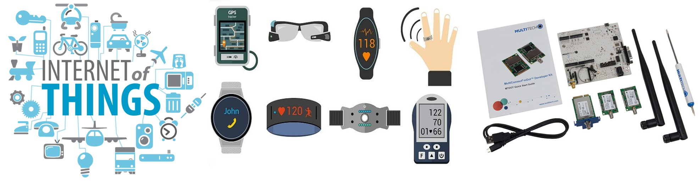
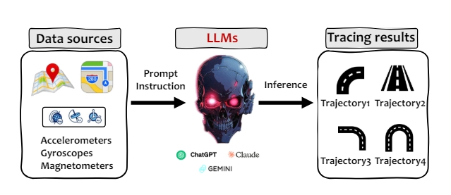
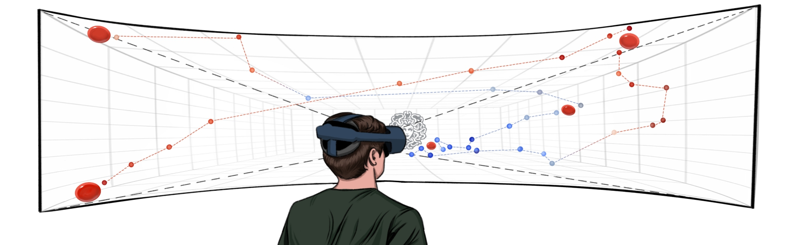
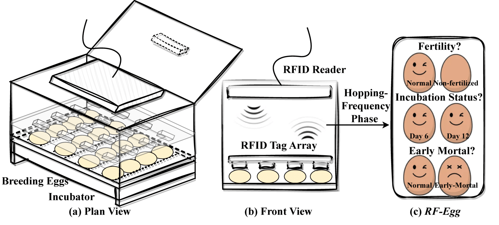
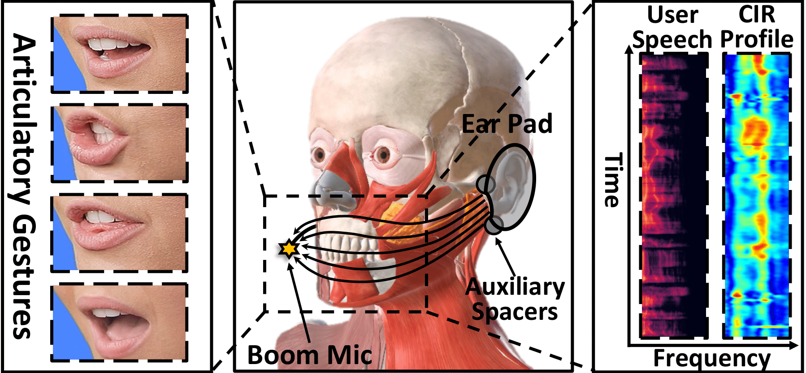

---
title:
layout: docs  # Do not modify.

# Optional header image (relative to `static/img/` folder).
header:
  caption: ""
  image: ""
---

  
<h2>Application of LLM in tracking.</h2>
<ul>
<li>[CPS-IoT Week CSCAIoTSys Workshop 2024] "Are You Being Tracked? Discover the Power of Zero-Shot Trajectory Tracing with LLMs!", Huanqi Yang, Sijie Ji, Rucheng Wu, and Weitao Xu.</li>
</ul>

  
<h2>User authentication for AR/VR devices.</h2>
<ul>
<li>[MobileHCI 2024] "Medusa3D: The Watchful Eye Freezing Illegitimate Users in Virtual Reality Interactions", Aochen Jiao, Di Duan, and Weitao Xu.</li>
</ul>

  
<h2>RFID-based egg incubation monitoring system.</h2>
<ul>
<li>[MobiCom 2024] "RF-Egg: An RF Solution for Fine-Grained Multi-Target and Multi-Task Egg Incubation Sensing", Zehua Sun, Tao Ni, Yongliang Chen, Di Duan, Kai Liu, and Weitao Xu.</li>
</ul>

  
<h2>Speech Enhancement for headphones.</h2>
<ul>
<li>[IMWUT 2024] "EarSE: Bringing Robust Speech Enhancement to COTS Headphones", Di Duan, Yongliang Chen, Weitao Xu, and Tianxing Li.</li>
</ul>

 
<h2>Security of Multi-Port Charger.</h2>
<ul>
<li>[MobiCom 2023] “XPorter: A Study of the Multi-Port Charger Security on Privacy Leakage and Voice Injection”, Tao Ni, Yongliang Chen, Weitao Xu, Lei Xue, and Qingchuan Zhao.</li>
</ul>


  
<h2>Key generation for LoRa-based smart transportation.</h2>
<ul>
<li>[ICDCS 2022] "Vehicle-Key: A Secret Key Establishment Scheme for LoRa-enabled IoV Communications", Huanqi Yang, Hongbo Liu, Yuezhong Wu, Chengwen Luo, Wei Li, Albert Zomaya, Linqi Song and Weitao Xu.</li>
</ul>

 
<h2>Acoustic-based user authentication for smartphones.</h2>
<ul>
<li>[IMWUT 2022] “SwipePass: Acoustic-based Second-factor User Authentication for Smartphones”, Yongliang Chen, Tao Ni, Weitao Xu, and Tao Gu.</li>
</ul>


  
<h2>Multi-view CNN-based animal species identification system.</h2>
<ul>
<li>[Ad Hoc Networks] "Multi-view CNN-based Acoustic Classifi cation System for Automatic Animal Species Identification", Weitao Xu, Xiang Zhang, Lina Yao, Wanli Xue, Bo Wei.</li>
</ul>

  
<h2>Smartwatch-based toothbrushing monitoring system.</h2>
<ul>
<li>[INFOCOM 2019] "Brush like a Dentist: Accurate Monitoring of Toothbrushing via Wrist-Worn Gesture Sensing", Chengwen Luo, Xingyu Feng, Junliang Chen, Weitao Xu, Jianqiang Li, Wei Li, Li Zhang, Zahir Tari, Albert Y. Zomaya.</li>
</ul>
 

  
<h2>Emergency light-based smart building solutions (Collaboration with <a href="https://wbstech.com.au/">WBS Technologies</a>).</h2>
<ul>
<li>[IEEE IoT Journal] "The Design, Implementation, and Deployment of a Smart Lighting System for Smart Building", Weitao Xu, Jin Zhang, Jun Young Kim, Salil Kanhere, Sanjay Jha, Wen Hu.</li>
</ul>


 
<h2>Key generation for LoRa.</h2>
<ul>
<li>[TrustCom 2018] “Exploring the Feasibility of Physical Layer Key Generation for LoRaWAN”, Weitao Xu, Sanjay Jha, Wen Hu.</li>
<li>[IEEE IoT Journal] "LoRa-Key: Secure Key Generation System for LoRa-based Network", Weitao Xu, Sanjay Jha, Wen Hu.</li>
</ul>


 
<h2>Smartglass-based eye tracking.</h2>
<ul>
<li>[Ubicomp 2018] “Continuous Authentication Using Eye Movement Response of Implicit Visual Stimuli”, Yongtuo Zhang, Wen Hu, Weitao Xu,  Chun Tong Chou. </li>
</ul>


 
<h2>Smartphone-based gait recognition system.</h2>
<ul>
<li>[IoTDI 2017] "Gait-Watch: A Context-aware Authentication System for Smart Watch Based on Gait Recognition", Weitao Xu, Yiran Shen, Yongtuo Zhang, Neil Bergmann, Wen Hu.</li>
</ul>


 
<h2>Face recognition on smart glasses.</h2>
<ul>
<li>[IPSN 2016] "Sensor-assisted Face Recognition System on Smart Glass via Multi-view Sparse Representation Classification", Weitao Xu, Yiran Shen, Neil Bergmann,Wen Hu.</li>
<li>[TMC] "Sensor-assisted Multi-view Face Recognition System on Smart Glass", Weitao Xu, Yiran Shen*, Neil Bergmann, Wen Hu.</li>
</ul>


 
<h2>Key generation for wearable devices.</h2>
<ul>
<li>[IPSN 2016] "Walkie-Talkie: Motion-Assisted Automatic Key Generation for Secure On-Body Device Communication", Weitao Xu, Girish Revadigar, Chengwen Luo, Neil Bergmann,Wen Hu.</li>
<li>[TOSN] "Gait-Key: A Gait-based Shared Secret Key Generation Protocol for Wearable Devices", Weitao Xu, Girish Revadigar, Chengwen Luo*, Neil Bergmann, Wen Hu.</li>
</ul>


              